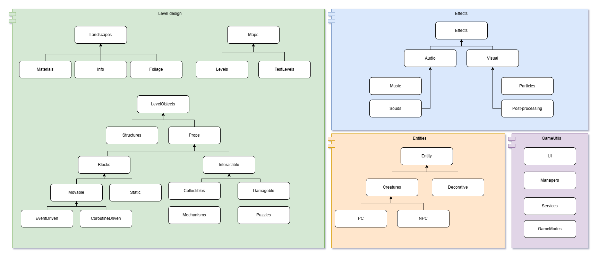
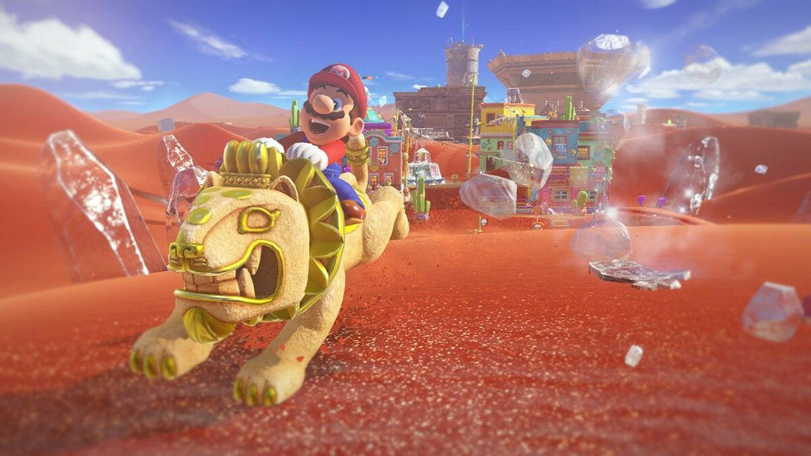
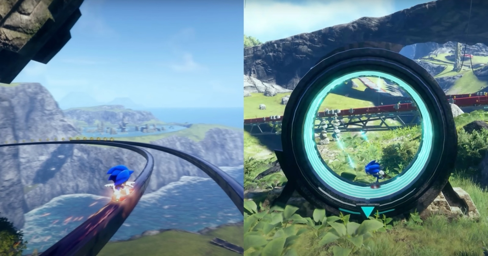
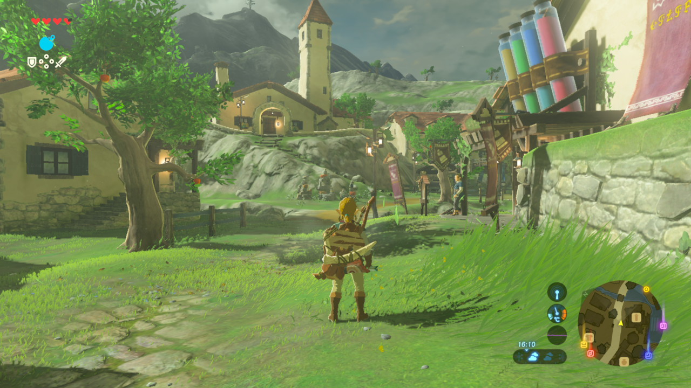

# Описание игры
## Основная информация
1. **Жанр**: 3D-платформер, песочница
2. **Аудитория**: Для всей семьи
3. **Сеттинг**: Мультяшное выдуманное королевство или целый мир
## Описание концепции
Главный герой - милая зверушка, пытается победить злодея, который набедокурил в небольшом королевстве. Для этого герою придётся вдоль и поперёк изучить местную флору и фауну, помочь местным жителям с их проблемами, разобраться с ситуацией и подготовиться к решающему бою. 

Игра пытается побудить исследовательские чувства игрока и всяческие награжает его начинания: по всему королевству разбросаны множество интересных пазлов, бонусов и сайд-квестов от разных жителей данного места. Чтобы добраться до главного злодея, герою придётся помочь жителям и разгадать загадки: только тогда он получит нужную информацию для своего дальнейшего путешествия. Здесь как раз играет элемент песочницы: игрок может делать что захочет и в любом порядке.
## Механики
1. Приятное управление персонажем (бег, прыжок, прыжок от стены, камера, ...)
2. Пазлы, разбросанные по миру
3. 3D платформиг по карте, использую возможости героя во всю
4. Сайд-квесты от жителей
## Архитектура папок

## Игры-референсы
1. Super Mario Odyssey

2. Sonic Frontiers

3. The Legend of Zelda: Breath of the Wild
